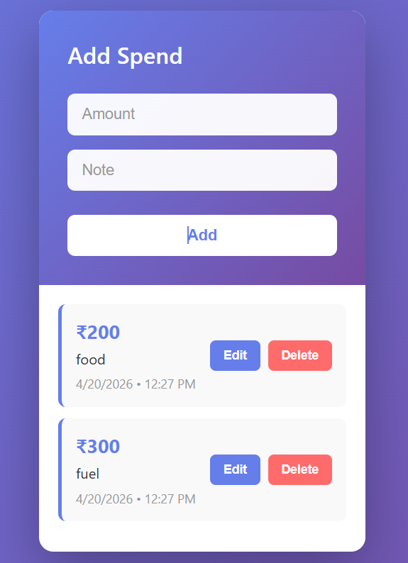

# 💰 Money Spends Tracker

A modern React-based expense tracking application that helps you manage and monitor your daily spending with an elegant and intuitive user interface.

## ✨ Features

- ✅ **Add Spends** - Easily add expenses with amount and description
- ✏️ **Edit Spends** - Modify existing expense entries
- 🗑️ **Delete Spends** - Remove unwanted expense records
- 📅 **Date & Time Tracking** - Automatic timestamp for each transaction
- 🔔 **Toast Notifications** - Get instant feedback for every action
- 📱 **Responsive Design** - Works perfectly on desktop and mobile devices
- 🎨 **Beautiful UI** - Modern gradient design with smooth animations
- 📜 **Fixed Container** - List scrolls internally without scrolling the entire page

## 🛠️ Tech Stack

- **Frontend:** React 18, Vite
- **Styling:** CSS3 with gradients and animations
- **Notifications:** react-hot-toast
- **Backend:** JSON Server (mock API)
- **Build Tool:** Vite

## 📦 Installation

### Prerequisites
- Node.js (v14 or higher)
- npm or yarn

### Setup Steps

1. **Clone the repository**
   ```bash
   git clone <repository-url>
   cd money-Spends
   ```

2. **Install dependencies**
   ```bash
   npm install
   ```

3. **Start the JSON Server** (in a separate terminal)
   ```bash
   npm run server
   ```

4. **Start the development server**
   ```bash
   npm run dev
   ```

5. **Open in browser**
   ```
   http://localhost:5173
   ```

## 🚀 Usage

### Adding a Spend
1. Enter the amount in the "Amount" field
2. Enter a description in the "Note" field
3. Click the "Add" button
4. A success notification will appear

### Editing a Spend
1. Click the "Edit" button next to any spend item
2. The form will populate with the spend details
3. Modify the amount or note as needed
4. Click the "Update" button
5. The changes will be saved

### Deleting a Spend
1. Click the "Delete" button next to any spend item
2. The expense will be removed immediately
3. A success notification will appear

## 📊 API Endpoints

The app uses a JSON Server with the following endpoints:

- **GET** `/Spends` - Fetch all spends
- **POST** `/Spends` - Create a new spend
- **PATCH** `/Spends/:id` - Update a spend
- **DELETE** `/Spends/:id` - Delete a spend

## 📁 Project Structure

```
money-Spends/
├── src/
│   ├── App.jsx           # Main application component
│   ├── App.css           # Application styles
│   ├── main.jsx          # React entry point
│   ├── database/
│   │   └── data.json     # Mock database
│   └── assets/           # Static assets
├── public/               # Public assets
├── package.json          # Project dependencies
├── vite.config.js        # Vite configuration
├── eslint.config.js      # ESLint configuration
└── README.md             # This file
```

## 🎨 Design Highlights

- **Color Scheme:** Purple gradient (#667eea to #764ba2)
- **Typography:** Segoe UI for modern appearance
- **Animations:** Smooth transitions and hover effects
- **Spacing:** Consistent padding and margins for clean layout
- **Responsiveness:** Mobile-first approach with breakpoints

## ⚙️ Configuration

### Environment Variables
Currently, the app connects to `http://localhost:3000` for the API. You can modify this in `App.jsx` if needed.

### Customization
- Colors can be changed in `App.css`
- API endpoints can be modified in `App.jsx`
- Toast notification settings can be customized with react-hot-toast options

## 🐛 Troubleshooting

**Issue:** API connection errors
- **Solution:** Ensure JSON Server is running on `http://localhost:3000`

**Issue:** Port already in use
- **Solution:** Change the port in `package.json` or kill the process using that port

**Issue:** Styles not loading
- **Solution:** Ensure you've installed all dependencies with `npm install`

## Preview



**Preview link :-** 

## 📝 License

This project is open source and available under the MIT License.

## 👨‍💻 Developer

Created for learning React, Vite, and modern web development practices.

---

**Made with 💜 by Devansh soni**
